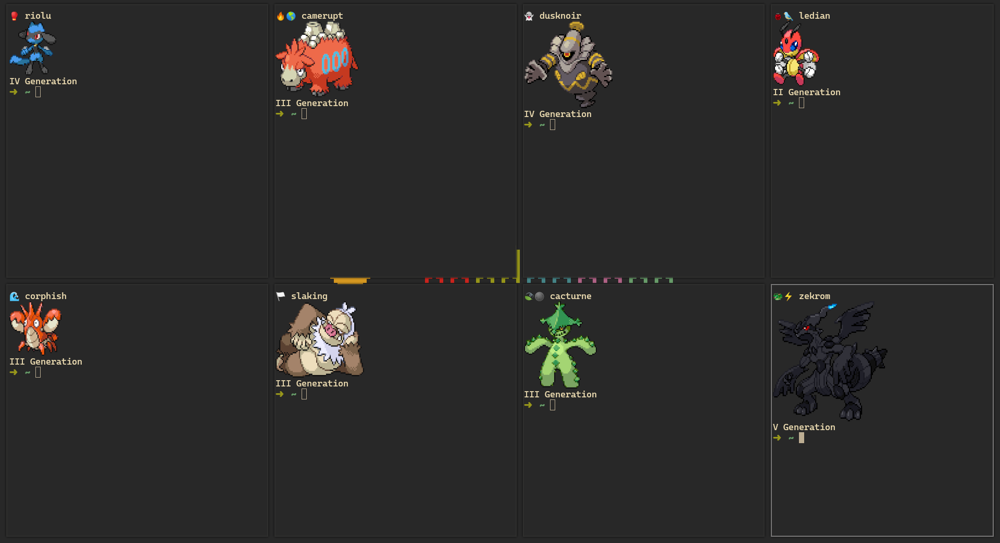

# pokemon-icat

This script is inspired by [this project](https://gitlab.com/phoneybadger/pokemon-colorscripts), but since the output heavily depends on the font of your terminal, i decided to make a script that shows a true PNG image of the Pokémon (of course, this script requires a terminal that supports images).



## Requirements

**Important**: this script currently works only on Kitty, but in [pokemon-icat.sh](pokemon-icat.sh) you can change this by editing the last line, which shows the picture in the terminal.

To use the script, you must first have all the these installed:

- a terminal which supports images (for example `Kitty`, which requires `ImageMagick`)
- `Python 3.8.x`
- `numpy` (Python library)
- `aiohttp` (Python library)

## Installation

After making sure that you have all of the requirements, run this command:

```sh
git clone https://github.com/ph04/pokemon-icat && cd pokemon-icat && sh ./install.sh
```

which should start the installation process of the script, by downloading every picture of every Pokémon.

By default, this will download every Pokémon with an upscaling factor of the original image of `3`, but if you want to change this behaviour run the last command with the option `--upscale [upscaling factor]`, for example:

```sh
./install.sh -u 15
```

## Usage

To show a random pokemon, simply run:

```sh
$HOME/.pokemon-icat/pokemon-icat.sh
```

If you want to specify one or more generations in particular, simply add `--gen [numbers]` at the end, for example:

```sh
$HOME/.pokemon-icat/pokemon-icat.sh -g 3 4 5
```

and for Hisuian Pokémons put `Hisui` as the generation argument, like this:

```sh
$HOME/.pokemon-icat/pokemon-icat.sh -g Hisui 8 9
```

If you want to show a pokemon in particular, just use the `--pokemon [pokemon]` flag, for example:

```sh
$HOME/.pokemon-icat/pokemon-icat.sh -p charizard
```

## Known issues

- Image `10186.png` won't be downloaded

## TODO list

- rename the other images to include every available sprite

